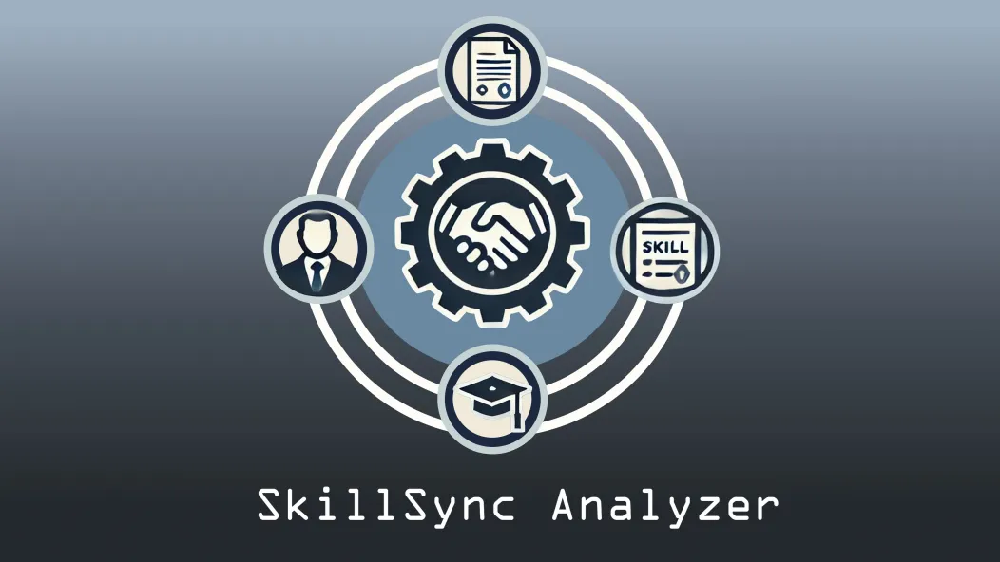

# SkillSync Analyzer Prototype

[Try SkillSync Analyzer here!](https://skillsyncanalyzer-0gtiy8v6.b4a.run/)

[See our presentation](https://docs.google.com/presentation/d/1cIhth9CdM2r_vSI295t0XNkt2aiXLaLeNpZAazjdpdg/edit?usp=sharing)

[Watch our demo](https://youtu.be/k4japGdSCOU)

This prototype is a submission for the [2024 lablab.ai Llama3 hackathon](https://lablab.ai/event/llama-3-ai-hackathon). The purpose of this application is to help job seekers better craft their resume or upskill for the roles they desire. Users can submit their resume, job description, and email address using our UI, then they will receive a full analysis of their resume to the email provided that includes:

- A gap analysis between the current resume and what is asked on the job description
- Suggestions for upskilling to fill the gaps identified
- Overall feedback on the resume and where it can improve
- A list of potential interview questions to prepare for based on the role in the job description and the user's resume 

## How to Use SkillSync Analyzer

SkillSync Analyzer is very simple to use. Simply upload your resume as a PDF or paste it into the form field provided. Do the same with a job description for a role that you'd like to apply for. Then provide a valid email address... 

That's it! With your resume, the job description for the role you want, and a valid email, SkillSync Analyzer will go over your resume, provide a gap analysis and give detailed recommendations on how to be a good fit for the role. The full PDF report will be emailed to the address you provided.


## Getting started - deploying locally

In order to build this, you need `Docker` installed on your system. Once you have that, you can move on to the next steps.

1. Build the image
   
   Inside of a terminal in the root directory of the project, run the following line:
   ```bash
   docker build -t resume_analyzer .
   ```
2. Build the container

   After the image is built, you can then run the container with the following command:

   ```bash
   docker run -d \
   --name resume_analyzer \
   --rm \
   -e TOGETHER_API_KEY="Your Together API key" \
   -e EMAIL_USER="Your email address" \
   -e EMAIL_PASSWORD="Your email password" \
   -p 5000:5000 \
   resume_analyzer
   ```
